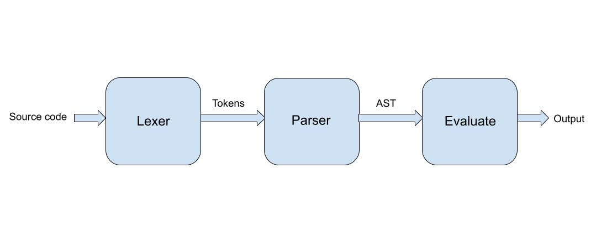

# HULK Interprete

Intérprete del lenguaje de programación [HULK](https://matcom.in/hulk/) (Havana University Language for Kompilers).

## Implementación

En este proyecto ha sido implementado un subconjunto del lenguaje HULK. El intérprete solo lee expresiones de una línea.

La expresión leida es procesada por el **Lexer**. El **Lexer** genera un secuencia de tokens que serán procesados por el **Parser** el cual genera un árbol de sintaxis abstracta que es evualuado y luego se imprime la respuesta. Cada uno de estos procesos captura posibles errores que puede haber tenido el usuario.



### Expresiones básicas

Todas las instrucciones en HULK terminan en `;`. El intérprete evaluará expresiones básicas como suma, resta, multiplicación, división, potenciación, resto de la división y concatenación de cadenas de caracteres.

### Funciones predefinidas

`print( <expression> )`: Devuelve la expresión.

`sqrt( <expression> )`: Devuelve la raiz cuadrada de la expresión.

`sin( <expression> )`: Devuelve el seno de la expresión.

`cos( <expression> )`: Devuelve el coseno de la expresión.

`exp( <expression> )`: Devuelve $e$ elevado a la expresión,

`log( <expression0>, <expression1>)`: Devuelve el logaritmo base `expression0` de `expresion1`.

`rand()`: Devuelve un un número aleatorio entre 0 y 1 (inclusivo).

### Condiciones

Las condiciones deben tener una parte `else`

```js
if ( <expression> ) <expression> else <expression> ;
```

### Declaracion de variables

Las variables declaradas solo se podrán usar dentro del cuerpo del `let-in`.

```js
let <identifier> = <expression>, ... in <expression> ;
```

### Declaración de funciones

Las funciones declaradas no podrán redefinirse.

```js
function <identifier>( <identifier>, ... ) => <expression> ;
```

### Errores

El intérprete mostrará uno de los 4 tipos de errores siguientes en caso de que se detecte algún error.

#### Lexical Error

Este error se produce por la presencia de tokens inválidos.

#### Sintax Error

Este error se produce por expresiones mal formadas como paréntesis no balanceados o expresiones incompletas.

#### Semantic Error

Este error se produce por el uso incorrecto de los tipos y argumentos.

#### StackOverflow

Este error se produce para prevenir un desbordamiento de la pila cuando se hacen muchas llamadas recursivas.
